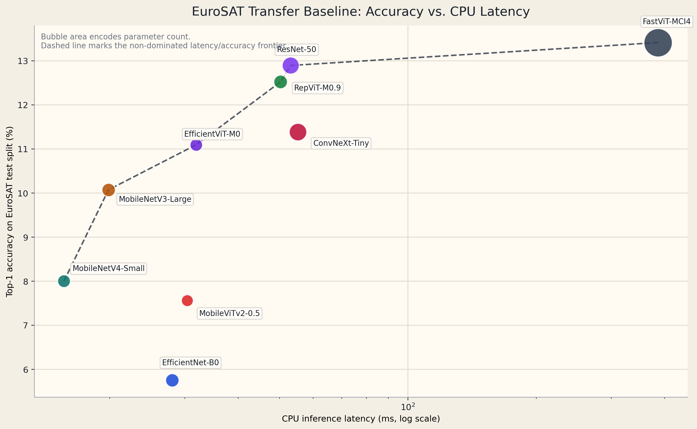
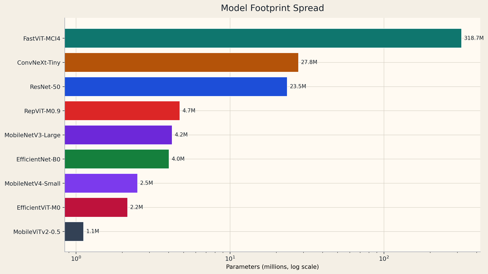
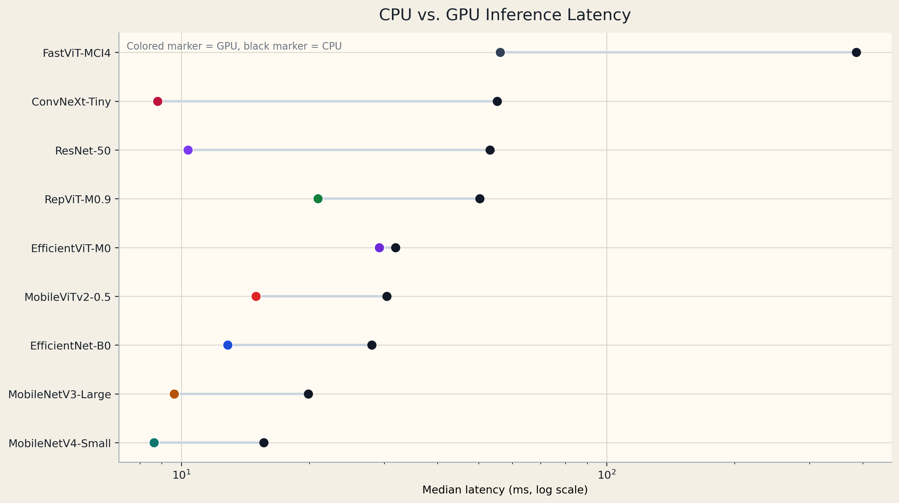
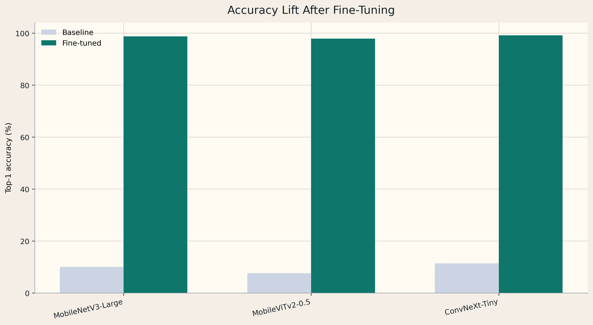

# EuroSAT Edge Vision Benchmark

> Benchmark modern edge backbones on aerial imagery, fine-tune the strongest candidates, and export deployment-ready artifacts for embedded inference workflows.

[](https://www.python.org/downloads/)
[](https://pytorch.org/)
[](https://huggingface.co/docs/timm)
[](LICENSE)

## What This Repository Demonstrates

This repository is built as an **edge-AI engineering artifact**, not a toy classifier:

- benchmark lightweight backbones on **EuroSAT** with latency, throughput, MACs, and footprint telemetry
- fine-tune the most relevant models on deterministic train/val/test splits
- compare **baseline vs. adapted** accuracy on the same held-out split
- export the best deployment candidate to **FP32 ONNX** and **INT8 QDQ ONNX**
- publish the results as a **GitHub Pages project page** and a **PDF packet with hyperlinks**

That sequence maps directly to the workflow described in the live [Quantum Systems AI Software Engineer role](https://career.quantum-systems.com/o/ai-software-engineer-mfd): prepare data, train and validate models, and optimize them for constrained deployment.

## Important Methodology Note

`01_run_benchmark.py` is **not** a true zero-shot benchmark.

It measures a **head-reset transfer baseline**:

1. load ImageNet-pretrained weights
2. replace the classifier with a fresh EuroSAT head
3. benchmark latency / throughput / footprint
4. evaluate before any supervised adaptation

That makes the baseline accuracy a **lower-bound transfer signal**, not a claim about true zero-shot overhead-image performance.

The actual adaptation stage is implemented in `03_finetune_models.py`.

## Dataset Integrity Fix

The repo now validates the local EuroSAT cache before benchmarking or training. During this pass, the previous local cache turned out to be an incomplete 9-class copy. The pipeline now refuses that state and regenerates deterministic splits only against the canonical **27,000 image / 10 class** RGB release.

## Verified Results

### Baseline benchmark snapshot

The current checked-in benchmark was rerun on the corrected 10-class split with CUDA-enabled PyTorch on an **NVIDIA GeForce RTX 3060 Laptop GPU**.

| Model | Top-1 (%) | CPU Latency (ms) | Params |
|---|---:|---:|---:|
| FastViT-MCI4 | 13.41 | 385.84 | 318.7M |
| ResNet-50 | 12.89 | 53.10 | 23.5M |
| RepViT-M0.9 | 12.52 | 50.31 | 4.7M |
| ConvNeXt-Tiny | 11.38 | 55.22 | 27.8M |
| EfficientViT-M0 | 11.09 | 31.88 | 2.2M |
| MobileNetV3-Large | 10.07 | 19.87 | 4.2M |
| MobileNetV4-Small | 8.00 | 15.62 | 2.5M |
| MobileViTv2-0.5 | 7.56 | 30.39 | 1.1M |
| EfficientNet-B0 | 5.75 | 28.02 | 4.0M |

These numbers are useful for **screening deployment characteristics**, not for deciding final model quality.

### Fine-tuning results

The staged transfer recipe uses:

- linear-probe warmup on the classifier head
- full fine-tuning with a lower backbone learning rate
- AdamW, cosine decay, warmup, label smoothing, gradient clipping, AMP

Held-out EuroSAT test results:

| Model | Top-1 (%) | Gain vs. baseline | Why it matters |
|---|---:|---:|---|
| ConvNeXt-Tiny | 99.14 | +87.76 pts | highest absolute accuracy |
| MobileNetV3-Large | 98.74 | +88.67 pts | best deployment candidate |
| MobileViTv2-0.5 | 97.90 | +90.34 pts | strongest tiny-model result |

This is the key technical takeaway: **supervised adaptation closes the domain gap almost completely** on the corrected EuroSAT split.

### Deployment export result

For deployment export, the best practical candidate is **MobileNetV3-Large**. It stays within 1 percentage point of the top fine-tuned score while preserving a much stronger latency profile than ConvNeXt-Tiny.

Generated artifacts:

- FP32 ONNX export: `results/deployment/mobilenet_v3_large/mobilenet_v3_large_fp32.onnx`
- ONNX validation against PyTorch outputs
- INT8 QDQ ONNX export: `results/deployment/mobilenet_v3_large/mobilenet_v3_large_int8_qdq.onnx`
- calibration dataset: `results/deployment/mobilenet_v3_large/calibration_data.npz`

Current status:

- ONNX export: complete
- INT8 quantization: complete
- TensorRT engine build: implemented and auto-attempted, but skipped on this machine because local `trtexec` / TensorRT tooling is not installed

## Figures

### Accuracy vs. CPU Latency



### Parameter Footprint



### CPU vs. GPU Latency



### Baseline vs. Fine-Tuned Accuracy



## GitHub Pages + PDF

The repo includes a static recruiter-facing project page in `docs/` and a GitHub Pages workflow in `.github/workflows/deploy-pages.yml`.

Expected public URLs after push:

- Project page: [https://kenantrivedi.github.io/efficient-vision-benchmark/](https://kenantrivedi.github.io/efficient-vision-benchmark/)
- Repository: [https://github.com/KenanTrivedi/efficient-vision-benchmark](https://github.com/KenanTrivedi/efficient-vision-benchmark)

The repo also generates a PDF-friendly portfolio packet with highlighted hyperlinks:

- `docs/assets/EuroSAT_Edge_Vision_Benchmark_Portfolio.pdf`

## Repository Workflow

### 1. Run the transfer baseline benchmark

```bash
python 01_run_benchmark.py
```

### 2. Fine-tune the selected models

```bash
python 03_finetune_models.py
```

### 3. Export deployment artifacts

```bash
python 04_export_deployment_artifacts.py --model-key mobilenet_v3_large
```

### 4. Regenerate figures and the project page

```bash
python 02_generate_visualizations.py
```

## Project Structure

```text
efficient-vision-benchmark/
├── 01_run_benchmark.py
├── 02_generate_visualizations.py
├── 03_finetune_models.py
├── 04_export_deployment_artifacts.py
├── configs/
│   ├── finetune_recipes.yaml
│   └── models.yaml
├── docs/
│   ├── index.html
│   ├── site_data.js
│   ├── site_data.json
│   └── assets/
├── results/
│   ├── benchmark_results.json
│   ├── figures/
│   ├── finetune/
│   └── deployment/
├── src/
│   ├── data.py
│   ├── metrics.py
│   ├── models.py
│   ├── timing.py
│   └── training.py
├── REPORT.md
└── requirements.txt
```

## References

1. Helber, P., et al. *EuroSAT: A Novel Dataset and Deep Learning Benchmark for Land Use and Land Cover Classification.* IEEE JSTARS 2019. [IEEE](https://ieeexplore.ieee.org/document/8736785)
2. Mehta, S. & Rastegari, M. *Separable Self-attention for Mobile Vision Transformers.* TPAMI 2023. [arXiv](https://arxiv.org/abs/2206.02680)
3. Wang, A., et al. *RepViT: Revisiting Mobile CNN From ViT Perspective.* CVPR 2024. [arXiv](https://arxiv.org/abs/2307.09283)
4. Qin, D., et al. *MobileNetV4: Universal Models for the Mobile Ecosystem.* CVPR 2024. [arXiv](https://arxiv.org/abs/2404.10518)
5. Liu, Z., et al. *A ConvNet for the 2020s.* CVPR 2022. [arXiv](https://arxiv.org/abs/2201.03545)

## License

MIT. See [LICENSE](LICENSE).
